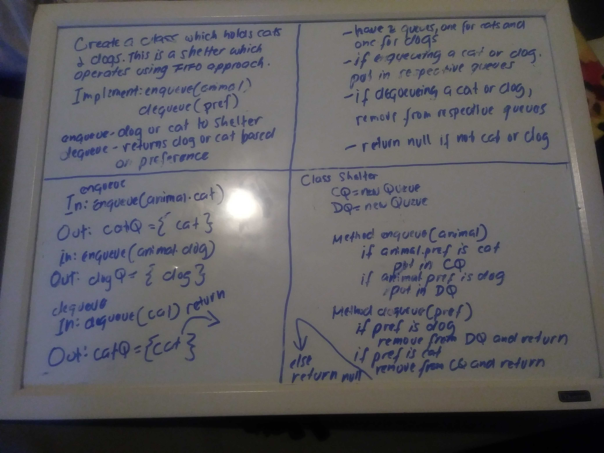

# Code Challenge

## FIFO Animal Shelter 
*Author: Joseph Hangarter*

---

### Problem Domain
* Create a class called AnimalShelter which holds only dogs and cats. The shelter operates using a first-in, first-out approach.
* Implement the following methods:
    * enqueue(animal): adds animal to the shelter. animal can be either a dog or a cat object.
    * dequeue(pref): returns either a dog or a cat. If pref is not "dog" or "cat" then return null.

---

### Inputs and Expected Outputs

* enqueue(dog)
* enqueue(cat)
* enqueue(bird)

| Input | Expected Output |
| :----------- | :----------- |
| Shelter = none | Shelter = dog |
| Shelter = dog | Shelter = dog , cat |
| Shelter = dog | Shelter = dog , cat (throw exception) |

* dequeue(cat)
* dequeue(dog)
* dequeue(bird)

| Input | Expected Output |
| :----------- | :----------- |
| Shelter = dog | Shelter = none, return cat |
| Shelter = dog, cat | Shelter = cat, return dog |
| Shelter = dog, cat | return null

---

### Big O

| Time | Space |
| :----------- | :----------- |
| O(1) | O(1) |

---

### Whiteboard Visual

---
