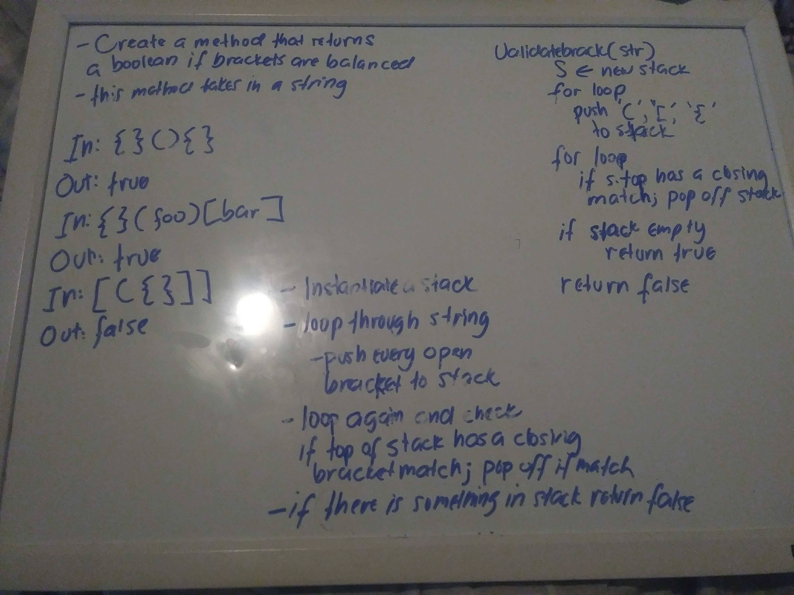

# Code Challenge

## Multi Bracket Validation 
*Author: Joseph Hangarter*

---

### Problem Domain
Your function should take a string as its only argument, and should return a boolean representing whether or not the brackets in the string are balanced. 

There are 3 types of brackets:

* Round Brackets : ()
* Square Brackets : []
* Curly Brackets : {}

---

### Inputs and Expected Outputs

| Input | Expected Output |
| :----------- | :----------- |
| "{ \}[ \]( \)" | true |
| "{hello\}[world\](foo\){bar\}" | Shelter = dog , cat |
| "[ ( { ] ) }" | true |
| "[ ( { \} ]" | false |
| "{ ( } )" | false |

---

### Big O

| Time | Space |
| :----------- | :----------- |
| O(1) | O(1) |

---

### Whiteboard Visual

---
