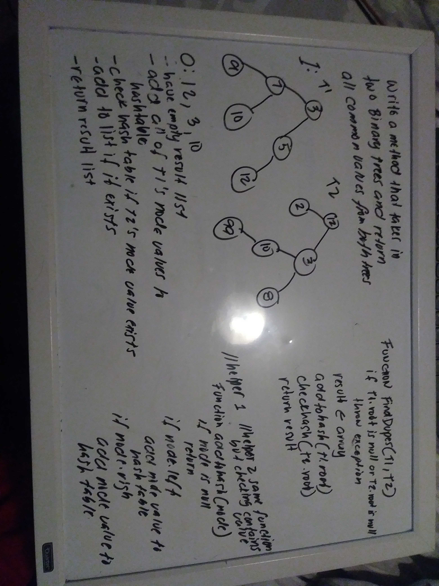

# Code Challenge

## Tree Intersection
Find common values in 2 Binary Trees

*Author: Joseph Hangarter*

---

### Problem Domain
* Write a function called tree_intersection that takes two binary tree parameters.
* Without utilizing any of the built-in library methods available to your language, return a set of values found in both trees.

### Big O

| Time | Space |
| :----------- | :----------- |
| O(n) | O(n) |

---

### Whiteboard Visual

