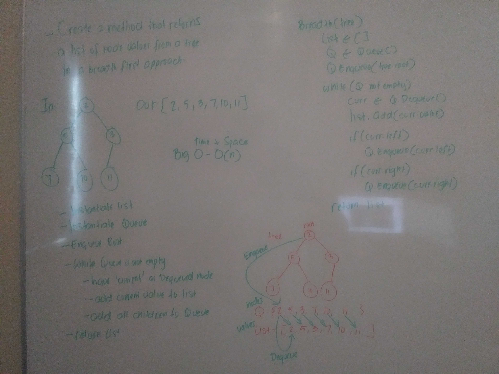
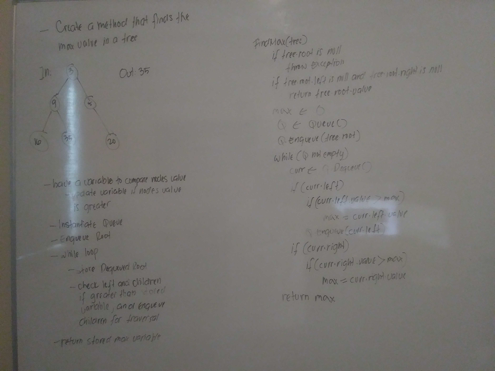

# Trees

## Challenge
* Create a Node class that has properties for the value stored in the node, the left child node, and the right child node.
* Create a BinaryTree class
    * Define a method for each of the depth first traversals called pre_order, in_order, and post_order which returns an array of the values, ordered appropriately.
    * Write a breadth first traversal method which takes a Binary Tree as its unique input. Without utilizing any of the built-in methods available to your language, traverse the input tree using a Breadth-first approach, and return a list of the values in the tree in the order they were encountered.

* Create a BinarySearchTree class
    * Define a method named add that accepts a value, and adds a new node with that value in the correct location in the binary search tree.
    * Define a method named contains that accepts a value, and returns a boolean indicating whether or not the value is in the tree at least once.

## Approach & Efficiency
* Big O; Time and Space
    * `pre_order()` - O(H)
    * `in_order()` - O(H)
    * `post_order()` - O(H)
    * `breadthfirst()` - O(n)
    * `add(value)` - O(H)
    * `contains(value)` - O(H)
    * `findmaximumvalue()` - O(n)

## API
* `class Node` - with value, left, and right attributes

* `class BinaryTree` - root attribute; depth (first 3) traversals shown below
    * `pre_order()` 
    * `in_order()`
    * `post_order()`
    * `breadthfirst()`
    * `findmaximumvalue()`

* `class BinarySeachTree` - extends from `BinaryTree`
    * `add(value)` - places node in correct position (lowest on left; highest on right)
    * `contains(value)` - returns boolean if value exists in the tree

## Whiteboard
* `breadthfirst`

* `findmaxvalue`
